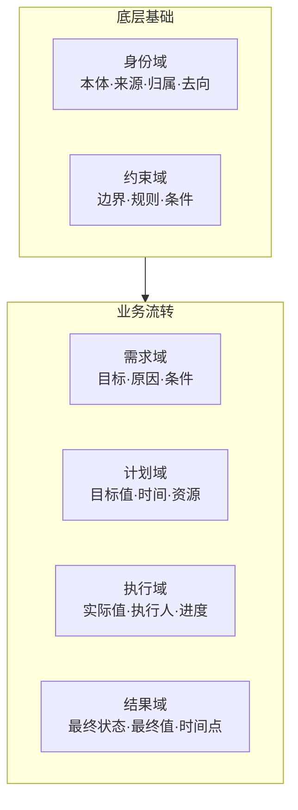

# OMD - Orthogonal Modeling Discipline

**正交建模准则，把业务建模变成"有规矩、能算账、可审查"的工程，让 AI 也能执行。**

***

## 为什么需要 OMD？

| 痛点           | 传统 DDD             | OMD           |
| ------------ | ------------------ | ------------- |
| 太抽象          | "限界上下文"、"聚合根"概念难理解 | 六域归属表，问法即判定   |
| 评审各说各话       | 凭直觉，没有客观标准         | 十条铁律，逐条核对     |
| 过度设计 vs 设计不足 | 拿不准拆不拆             | 复杂度测算，量化决策    |
| AI 无法执行      | 规则模糊，AI 无法判断       | 规则明确，AI 可执行建模 |

***

## 六域模型概览



**核心原则**：每个属性只属于一个域，跨域必须拆分。

***

## 十条铁律

| 序号 | 准则           | 一句话解释                                                  |
| -- | ------------ | ------------------------------------------------------ |
| 1  | 一个属性只属于一个域   | 别把计划数量和实际数量混成一个字段                                      |
| 2  | 不同业务的状态要分开   | 报价态和合同态是两回事，别合并                                        |
| 3  | 多个状态用组合，不要合并 | 用 `auditStatus × refundStatus`，别造 `AUDITING_REFUNDING` |
| 4  | 状态要完整、不重叠    | 覆盖所有情况，别留盲区                                            |
| 5  | 结果只追加，不覆盖    | 用流水表记录，别覆盖历史                                           |
| 6  | 计划和实际要分开     | `plannedQty` 和 `actualQty` 分开                          |
| 7  | 规则要写成属性      | 别把规则藏在代码里                                              |
| 8  | 用基础类型，不要JSON | 别用 `extra_data` JSON 字段                                |
| 9  | 状态要有始有终      | 有起点和终点，别出僵尸状态                                          |
| 10 | 同名不同域要隔离     | `OrderCustomer` 和 `ContractCustomer` 分开                |

***

## 一个案例看懂

**场景**：出货单涉及三个独立流程——单据确认、物流配送、报关申报。

### ❌ 错误：合并成一个状态链


**问题**：设计者不知道发生了什么，状态链混乱：

- "已订舱"是物流还是单据？
- "已申报"插在哪？开船前还是开船后？
- 业务说"可以先开船再报关"→ 状态链被打断
- 业务说"报关被驳回要重新申报"→ 没法表达
- 大模型评审时也容易犯这个错，看不出问题在哪

**根本原因**：违反铁律 #2 —— 不同业务的状态要分开。单据、物流、报关是三个独立业务空间。

### ✅ 正确：拆成三个独立状态

```
单据流程 docStatus:     草稿 → 已提交

物流流程 shipStatus:    未出运 → 已订舱 → 已开船 → 已运达

报关流程 customsStatus: 未报关 → 已申报 → 已放行 → 已结关
```

**组合矩阵（2×4×4=32种）**：

| 单据状态 | 物流状态 | 报关状态 | 业务含义      |
| ---- | ---- | ---- | --------- |
| 草稿   | 未出运  | 未报关  | 用户编辑中     |
| 已提交  | 未出运  | 未报关  | 待订舱       |
| 已提交  | 已订舱  | 未报关  | 待开船       |
| 已提交  | 已开船  | 未报关  | 运输中，待报关   |
| 已提交  | 已开船  | 已申报  | 运输中，报关审核中 |
| 已提交  | 已开船  | 已放行  | 运输中，报关通过  |
| 已提交  | 已运达  | 已结关  | 已完成       |

**六域判定**：

- 单据状态 → 结果域（单据确认流程的终态）
- 物流状态 → 结果域（物流配送流程的终态）
- 报关状态 → 结果域（报关申报流程的终态）

**判定依据**：

- 说的是不同的事：单据确认 vs 物流配送 vs 报关申报
- 流转规则不一样：用户操作 vs 物流公司 vs 报关行
- 不同人看不同的：销售看单据，物流看船期，报关看申报

***

## 快速开始

### 在 opencode/claude 中使用

直接放入即可：

```bash
# 将本项目克隆到 Skills 目录
cd ~/.trae/skills
git clone https://github.com/c5ms/odm.git odm
cp odm/skills path-to-your-app/.agents/skills

# 使用
/m-modeling 评审下订单模型设计
/m-modeling 分析下 User 类的属性设计
/m-modeling 设计一个发货单实体
```

## 文档

| 文档                                                              | 内容               | 何时看     |
| --------------------------------------------------------------- | ---------------- | ------- |
| [1.guide.md](skills/m-modeling/references/1.guide.md)           | 六域 + 十条铁律 + 建模步骤 | 必读      |
| [2.exceptions.md](skills/m-modeling/references/2.exceptions.md) | 技术属性（冗余存储、乐观锁等）  | 建模完成后   |
| [3.complexity.md](skills/m-modeling/references/3.complexity.md) | 复杂度测算（防止过度设计）    | 拿不准拆不拆时 |
| [demo.md](skills/m-modeling/references/demo.md)                 | 案例演示             | 学习参考    |

***

## 项目结构

```
odm/
├── README.md
├── CONTRIBUTING.md
└── skills/
    └── m-modeling/
        ├── SKILL.md              # AI Skill 定义
        └── references/
            ├── 1.guide.md        # 主指南（必读）
            ├── 2.exceptions.md   # 排除特例
            ├── 3.complexity.md   # 复杂度测算
            └── 4.demo.md         # 案例演示
```

***

## 与其他 DDD 资源的关系

| 资源                     | 提供什么                        |
| ---------------------- | --------------------------- |
| ddd-starter            | 流程图：从哪开始、按什么顺序做             |
| EventStorming          | 发现工具：挖掘业务事件                 |
| Bounded Context Canvas | 设计模板：定义上下文边界                |
| **OMD**                | **检查清单 + 计算器：属性怎么拆、状态怎么设计** |

***

## 适用场景

- 新项目建模
- 现有模型评审
- 重构前审查
- 团队规范统一
- AI 辅助开发

***

## 许可证

MIT License
