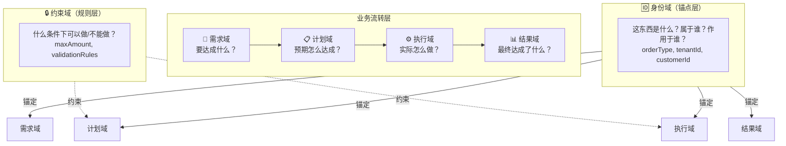
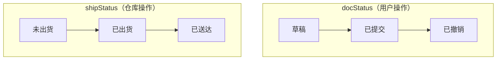

# ODM - 正交领域建模

**把业务建模变成"有规矩、能算账、可审查"的工程，让 AI 也能执行。**

---

## 为什么需要 ODM？

| 痛点 | 传统 DDD | ODM |
|------|----------|-----|
| 太抽象 | "限界上下文"、"聚合根"概念难理解 | 六域归属表，问法即判定 |
| 评审各说各话 | 凭直觉，没有客观标准 | 十条铁律，逐条核对 |
| 过度设计 vs 设计不足 | 拿不准拆不拆 | 复杂度测算，量化决策 |
| AI 无法执行 | 规则模糊，AI 无法判断 | 规则明确，AI 可执行建模 |

---

## 30秒看懂



**一句话**：每个属性只属于一个域，跨域必须拆分。

---

## 核心概念

### 六域归属表

| 域 | 问法 | 典型属性 |
|----|------|---------|
| 身份域 | 这东西是什么？属于谁？作用于谁？ | orderType, tenantId, customerId |
| 需求域 | 要达成什么业务目标？ | requirement, businessGoal |
| 计划域 | 预期怎么达成？ | plannedQty, deadline |
| 执行域 | 实际怎么做？ | actualQty, executor |
| 结果域 | 最终达成了什么？ | status, completedAt |
| 约束域 | 什么条件下可以做/不能做？ | maxAmount, validationRules |

### 十条铁律

| 序号 | 准则 | 一句话解释 |
|------|------|-----------|
| 1 | 一个属性只属于一个域 | 别把计划数量和实际数量混成一个字段 |
| 2 | 不同业务的状态要分开 | 报价态和合同态是两回事，别合并 |
| 3 | 多个状态用组合，不要合并 | 用 `auditStatus × refundStatus`，别造 `AUDITING_REFUNDING` |
| 4 | 状态要完整、不重叠 | 覆盖所有情况，别留盲区 |
| 5 | 结果只追加，不覆盖 | 用流水表记录，别覆盖历史 |
| 6 | 计划和实际要分开 | `plannedQty` 和 `actualQty` 分开 |
| 7 | 规则要写成属性 | 别把规则藏在代码里 |
| 8 | 用基础类型，不要JSON | 别用 `extra_data` JSON 字段 |
| 9 | 状态要有始有终 | 有起点和终点，别出僵尸状态 |
| 10 | 同名不同域要隔离 | `OrderCustomer` 和 `ContractCustomer` 分开 |

---

## 一个案例看懂

**场景**：出货单有两个独立流程——"单据确认"和"货物配送"。

### ❌ 错误：合并成一个状态链


**问题**：业务要加"撤销"
- 撤销插在哪？状态链被打断
- 已出货后还能撤销吗？→ 出现"已出货且已撤销"
- 状态叠加，if-else 暴增

### ✅ 正确：拆成两个独立状态



**组合矩阵（3×3=9种）**：

| 单据状态 | 物流状态 | 业务含义 |
|----------|----------|----------|
| 草稿 | 未出货 | 可编辑 |
| 已提交 | 未出货 | 待发货 |
| 已提交 | 已出货 | 配送中 |
| 已提交 | 已送达 | 已签收 |
| 已撤销 | 未出货 | 撤销成功 |
| 已撤销 | 已出货 | 需召回 |

---

## 快速开始

### 在 Trae 中使用

Trae 支持 Skills 目录，直接放入即可：

```bash
# 将本项目克隆到 Skills 目录
cd ~/.trae/skills
git clone https://github.com/xxx/odm.git m-modeling

# 使用
/m-modeling 评审下订单模型设计
/m-modeling 分析下 User 类的属性设计
/m-modeling 设计一个发货单实体
```

### 在 Cursor 中使用

Cursor 使用 `.cursorrules` 文件配置：

```bash
# 方法1：直接复制 SKILL.md 内容到 .cursorrules
cat skills/m-modeling/SKILL.md >> .cursorrules

# 方法2：在 .cursorrules 中引用
echo "参考 skills/m-modeling/ 目录下的建模指南" >> .cursorrules

# 使用（Cursor 会自动识别规则）
# 直接在对话中说：
"用 ODM 六域建模方法评审下订单模型设计"
```

### 在 Claude 中使用

Claude 使用 `CLAUDE.md` 文件配置：

```bash
# 在项目根目录创建 CLAUDE.md
cat skills/m-modeling/SKILL.md > CLAUDE.md

# 或追加到现有 CLAUDE.md
cat skills/m-modeling/SKILL.md >> CLAUDE.md

# 使用
# 直接在对话中说：
"用 ODM 方法分析下这个实体类的属性设计"
```

### 在 OpenCode 中使用

OpenCode 支持自定义指令文件：

```bash
# 将 SKILL.md 内容添加到 OpenCode 的指令配置
# 具体路径取决于 OpenCode 版本

# 使用
# 直接在对话中说：
"按照六域归属表评审下这个表结构"
```

### 作为团队规范（不依赖 AI 工具）

1. 读 [1.guide.md](skills/m-modeling/references/1.guide.md) —— 学六域 + 十条铁律 + 建模步骤
2. 读 [4.demo.md](skills/m-modeling/references/4.demo.md) —— 看案例
3. 建模时按步骤执行，输出属性归属表 + 状态矩阵
4. 评审时用十条铁律逐条核对

---

## 文档

| 文档 | 内容 | 何时看 |
|------|------|--------|
| [1.guide.md](skills/m-modeling/references/1.guide.md) | 六域 + 十条铁律 + 建模步骤 | 必读 |
| [2.exceptions.md](skills/m-modeling/references/2.exceptions.md) | 技术属性（冗余存储、乐观锁等） | 建模完成后 |
| [3.complexity.md](skills/m-modeling/references/3.complexity.md) | 复杂度测算（防止过度设计） | 拿不准拆不拆时 |
| [demo.md](skills/m-modeling/references/demo.md) | 案例演示 | 学习参考 |

---

## 项目结构

```
odm/
├── README.md
├── CONTRIBUTING.md
└── skills/
    └── m-modeling/
        ├── SKILL.md              # AI Skill 定义
        └── references/
            ├── 1.guide.md        # 主指南（必读）
            ├── 2.exceptions.md   # 排除特例
            ├── 3.complexity.md   # 复杂度测算
            └── 4.demo.md         # 案例演示
```

---

## 与其他 DDD 资源的关系

| 资源 | 提供什么 |
|------|---------|
| ddd-starter | 流程图：从哪开始、按什么顺序做 |
| EventStorming | 发现工具：挖掘业务事件 |
| Bounded Context Canvas | 设计模板：定义上下文边界 |
| **ODM** | **检查清单 + 计算器：属性怎么拆、状态怎么设计** |

---

## 适用场景

- 新项目建模
- 现有模型评审
- 重构前审查
- 团队规范统一
- AI 辅助开发

---

## 许可证

MIT License