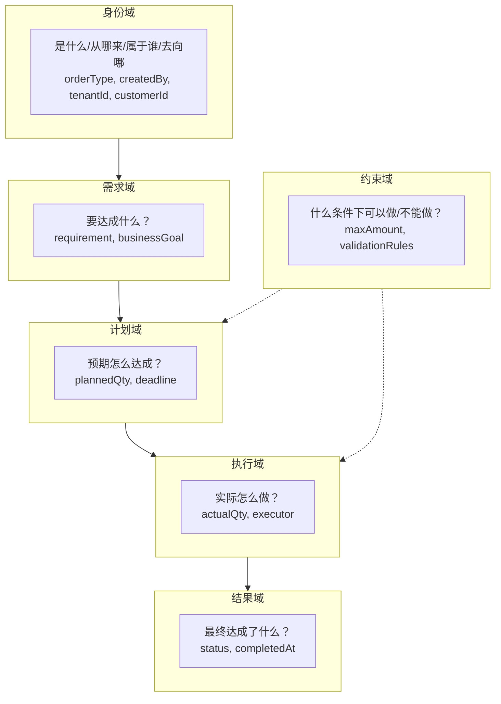

# 六域定义与归属判定

> 一个属性只属于一个域，不能跨域。

***

## 六域模型

***

## 域定义

### 身份域

> 定义"是什么、从哪来、属于谁、去向哪"，是其他域的地基与锚点。

**四维抽象（存在论）**：

| 维度 | 哲学含义  | 问法      | 说明          | 示例属性                            |
| -- | ----- | ------- | ----------- | ------------------------------- |
| 本体 | 存在的本质 | 这东西是什么？ | 一旦定义，基因不可突变 | orderType, entityType, category |
| 来源 | 存在的起源 | 从哪里来？   | 创建时确定，永不变化  | createdBy, sourceSystem         |
| 归属 | 存在的管辖 | 属于谁？    | 决定谁有权力修改    | tenantId, departmentId          |
| 去向 | 存在的指向 | 作用于谁？   | 业务客体指向      | customerId, supplierId          |

**核心特征**：是其他域的支撑（地基与锚点）。需求/计划/执行/结果都挂靠于此。

**不可变性分级**：

| 维度 | 不可变性  | 修改成本            |
| -- | ----- | --------------- |
| 本体 | 绝对不可变 | 只能作废重建          |
| 来源 | 绝对不可变 | 只能作废重建          |
| 归属 | 相对不可变 | 需要权限审批          |
| 去向 | 相对不可变 | 需要权限审批 + 关联数据处理 |

**铁律**：本体和来源绝对不可变。归属和去向的修改需要严格审批，并处理关联数据。

***

### 需求域

> 描述"要达成什么业务目标"，是计划的依据。

**三维抽象（目的论）**：

| 维度 | 哲学含义    | 问法     | 说明        | 示例属性                           |
| -- | ------- | ------ | --------- | ------------------------------ |
| 目标 | 期望达成的状态 | 要达成什么？ | 业务语言，定性描述 | requirement, businessGoal      |
| 原因 | 需求的来源   | 为什么需要？ | 业务背景和动机   | purpose, reason, background    |
| 条件 | 需求的前提   | 什么情况下？ | 触发条件或前置要求 | precondition, triggerCondition |

**核心特征**：不涉及具体执行细节，是"要什么"而非"怎么做"。

**铁律**：需求域与计划域必须分离。需求是业务语言，计划是量化契约。

***

### 计划域

> 描述"预期怎么达成"，是可量化的契约。

**三维抽象（意向论）**：

| 维度  | 哲学含义    | 问法      | 说明     | 示例属性                                       |
| --- | ------- | ------- | ------ | ------------------------------------------ |
| 目标值 | 预期达成的量  | 预期多少？   | 可量化的目标 | plannedQty, targetAmount, budget           |
| 时间  | 预期的时间点  | 预期什么时候？ | 时间契约   | deadline, plannedStartDate, plannedEndDate |
| 资源  | 预期投入的资源 | 预期用什么？  | 资源分配   | plannedResource, assignedTeam              |

**核心特征**：是意图而非事实，可以被调整，但一旦锁定就是契约。

**铁律**：计划域与执行域必须分离。计划是"预期"，执行是"实际"。

***

### 执行域

> 描述"实际怎么做"，是实时变化的过程。

**三维抽象（行动论）**：

| 维度  | 哲学含义   | 问法    | 说明   | 示例属性                                      |
| --- | ------ | ----- | ---- | ----------------------------------------- |
| 实际值 | 实际达成的量 | 实际多少？ | 实时数据 | actualQty, executedAmount, completedCount |
| 执行人 | 谁在执行   | 谁在做？  | 执行主体 | executor, operator, handler               |
| 进度  | 做到哪了   | 进度如何？ | 过程状态 | progress, currentStep, percentage         |

**核心特征**：执行过程中频繁变化，是"正在做"的实时快照。

**铁律**：执行域与结果域必须分离。执行是过程，结果是事实。

***

### 结果域

> 描述"最终达成了什么"，是不可变的事实。

**三维抽象（因果论）**：

| 维度   | 哲学含义  | 问法      | 说明     | 示例属性                               |
| ---- | ----- | ------- | ------ | ---------------------------------- |
| 最终状态 | 达成的状态 | 最终什么状态？ | 业务终态   | status, outcome, result            |
| 最终值  | 最终的量  | 最终多少？   | 不可变的数值 | finalAmount, finalQty, totalCost   |
| 时间点  | 完成的时间 | 什么时候完成？ | 历史时间戳  | completedAt, closedAt, finalizedAt |

**核心特征**：事实发生后追加，永不修改，是历史记录。

**铁律**：结果域数据只能追加，不能覆盖。用流水表记录，而非字段覆盖。

***

### 约束域

> 描述"什么条件下可以做/不能做"，是业务规则的载体。

**三维抽象（规范论）**：

| 维度 | 哲学含义   | 问法     | 说明   | 示例属性                                      |
| -- | ------ | ------ | ---- | ----------------------------------------- |
| 边界 | 不能超过什么 | 上限/下限？ | 数值边界 | maxAmount, minQty, upperLimit, lowerLimit |
| 规则 | 必须满足什么 | 必须符合？  | 业务规则 | validationRules, businessRules            |
| 条件 | 什么情况下  | 触发条件？  | 前置条件 | preconditions, eligibilityCriteria        |

**核心特征**：是规则而非数据，相对稳定，定义业务边界。

**铁律**：约束必须显式化，不能隐含在代码逻辑中。

***

## 十条铁律

> 以下准则为硬性约束，设计与评审时必须逐条核对。

| 序号 | 准则           | 说明                            | ✅正确                                 | ❌错误                     |
| -- | ------------ | ----------------------------- | ----------------------------------- | ----------------------- |
| 1  | 一个属性只属于一个域   | 属性归属严格限定于身份、需求、计划、执行、结果、约束六个域 | 计划域`targetQty`，执行域`actualQty`       | 混合为`qty`                |
| 2  | 不同业务的状态要分开   | 不同业务子空间的生命周期正交，按空间拆分独立枚举      | 报价态、合同态各独立枚举                        | `待发货=已付+未发`存数据库         |
| 3  | 多个状态用组合，不要合并 | 同空间内状态并发时，拆为多维独立枚举取笛卡尔积       | `auditStatus` × `refundStatus`      | `AUDITING_REFUNDING`混合态 |
| 4  | 状态要完整、不重叠    | 同空间单维枚举取值绝对互斥且完全穷尽            | `DRAFT/SUBMITTED/APPROVED/REJECTED` | 缺少`REVOKED`导致盲区         |
| 5  | 结果只追加，不覆盖    | 结果域数据强绑定时间戳绝对不可变              | `List<PaymentRecord>`追加             | 覆盖`paymentStatus`       |
| 6  | 计划和实际要分开     | 计划域锁定目标契约，执行域承载易变细节           | `plannedQty`与`actualQty`分离          | 单一`qty`混用               |
| 7  | 规则要写成属性      | 业务规则脱离代码控制流，沉淀为独立规约           | `maxAmount`字段                       | 隐含在`validate()`方法中      |
| 8  | 用基础类型，不要JSON | 属性类型穷尽至基础数据类型或值对象             | `BigDecimal amount`                 | 主表加`extra_data` JSON    |
| 9  | 状态要有始有终      | 状态机必含单一起始态与可达终态               | `DRAFT`起始、`COMPLETED`终态             | 无终态导致僵尸                 |
| 10 | 同名不同域要隔离     | 同名词不同业务域必须物理或逻辑隔离             | `OrderCustomer`/`ContractCustomer`  | 全局`Customer`混杂多职责       |

***

## 铁律适用边界

> 铁律是硬性约束，但现实中有些铁律不能死守。以下边界说明何时可放宽。

| 铁律 | 严格适用 | 可放宽 |
|------|----------|--------|
| 计划和实际要分开 | 核心业务单据（订单、合同） | 内部简单领用、无偏差追踪需求 |
| 不要JSON | 业务核心属性 | 技术配置、动态属性、真正不确定的扩展场景 |
| 结果只追加 | 已确认的业务事实（支付记录、发货记录） | 草稿态、推演态、未提交的中间过程 |
| 不同业务的状态要分开 | 有独立流程和查询需求 | 总是捆绑使用、无独立业务意义 |
| 规则要写成属性 | 需要动态调整的规则 | 固定的全局规则（如"所有订单不能超过10000"） |

***

## 反模式清单

> 常见的错误设计，一眼就能对号入座。

| 反模式 | 症状 | 违反铁律 | 改法 |
|--------|------|----------|------|
| 状态缝合怪 | 枚举里出现 `A_B_C` 混合态 | #2 不同业务的状态要分开 | 拆成独立状态字段 |
| 意图执行混淆 | `qty` 一会儿是计划一会儿是实际 | #6 计划和实际要分开 | 拆成 `plannedQty` + `actualQty` |
| 规则藏在代码里 | 只有看 `validate()` 才知道限额 | #7 规则要写成属性 | 加 `maxAmount` 字段 |
| 僵尸状态 | 状态流转到某一步卡死，没有终态 | #9 状态要有始有终 | 检查状态机终态 |
| 黑盒JSON | 主表有 `extra_data` JSON 字段 | #8 用基础类型 | 拆成独立字段或 KV 表 |
| 跨域属性 | 一个字段既描述计划又描述执行 | #1 一个属性只属于一个域 | 按六域拆分 |
| 状态链断裂 | 加新状态后，原有流程被打断 | #3 多个状态用组合 | 用组合矩阵而非链式 |

***

## 归属判定表

### 判定步骤

1. **问自己**：这个属性描述的是什么？
2. **查下表**：根据特征匹配对应域
3. **验证**：确认不跨域

### 判定矩阵

| 问题                | 身份域 | 需求域 | 计划域 | 执行域 | 结果域 | 约束域 |
| ----------------- | :-: | :-: | :-: | :-: | :-: | :-: |
| 定义"本体/来源/归属/去向"？  |  ✅  |  ❌  |  ❌  |  ❌  |  ❌  |  ❌  |
| 定义"目标/原因/条件"？     |  ❌  |  ✅  |  ❌  |  ❌  |  ❌  |  ❌  |
| 定义"目标值/时间/资源"？    |  ❌  |  ❌  |  ✅  |  ❌  |  ❌  |  ❌  |
| 定义"实际值/执行人/进度"？   |  ❌  |  ❌  |  ❌  |  ✅  |  ❌  |  ❌  |
| 定义"最终状态/最终值/时间点"？ |  ❌  |  ❌  |  ❌  |  ❌  |  ✅  |  ❌  |
| 定义"边界/规则/条件"？     |  ❌  |  ❌  |  ❌  |  ❌  |  ❌  |  ✅  |
| 本体/来源绝对不可变？       |  ✅  |  ❌  |  ❌  |  ❌  |  ❌  |  ❌  |
| 执行中频繁变化？          |  ❌  |  ❌  |  ❌  |  ✅  |  ❌  |  ❌  |
| 事实发生后追加？          |  ❌  |  ❌  |  ❌  |  ❌  |  ✅  |  ❌  |

***

## 判定案例

### 案例1：身份域属性

| 属性         | 判定问题     | 归属域     |
| ---------- | -------- | ------- |
| orderType  | 定义"本体"吗？ | 身份域（本体） |
| createdBy  | 定义"来源"吗？ | 身份域（来源） |
| tenantId   | 定义"归属"吗？ | 身份域（归属） |
| customerId | 定义"去向"吗？ | 身份域（去向） |

### 案例2：需求域 vs 计划域

| 属性          | 判定问题      | 归属域      |
| ----------- | --------- | -------- |
| requirement | 定义"目标"吗？  | 需求域（目标）  |
| purpose     | 定义"原因"吗？  | 需求域（原因）  |
| plannedQty  | 定义"目标值"吗？ | 计划域（目标值） |
| deadline    | 定义"时间"吗？  | 计划域（时间）  |

### 案例3：计划域 vs 执行域 vs 结果域

| 属性         | 判定问题      | 归属域      |
| ---------- | --------- | -------- |
| plannedQty | 定义"目标值"吗？ | 计划域（目标值） |
| actualQty  | 定义"实际值"吗？ | 执行域（实际值） |
| finalQty   | 定义"最终值"吗？ | 结果域（最终值） |

### 案例4：金额相关

| 属性           | 判定问题      | 归属域      |
| ------------ | --------- | -------- |
| targetAmount | 定义"目标值"吗？ | 计划域（目标值） |
| actualAmount | 定义"实际值"吗？ | 执行域（实际值） |
| finalAmount  | 定义"最终值"吗？ | 结果域（最终值） |
| maxAmount    | 定义"边界"吗？  | 约束域（边界）  |

### 案例5：时间相关

| 属性          | 判定问题      | 归属域      |
| ----------- | --------- | -------- |
| createdAt   | 定义"来源"吗？  | 身份域（来源）  |
| deadline    | 定义"时间"吗？  | 计划域（时间）  |
| executedAt  | 定义"进度"吗？  | 执行域（进度）  |
| completedAt | 定义"时间点"吗？ | 结果域（时间点） |

***

## 建模步骤

> **核心原则**：先属性，后状态。属性是实体，状态是实体的生命周期投影。

1. **列出所有业务概念与属性**
   - 不要先定状态，先定属性
   - 属性是实体的"原子数据"，状态是属性变化的"投影"
   - 示例：出货单属性 → 单据编号、创建时间、计划数量、实际数量、发货时间、送达时间
2. **按六域对属性分组**
   - 参考上方"归属判定表"进行判定
   - 示例：身份域(单据编号、创建人)、计划域(计划数量)、执行域(实际数量、发货人)、结果域(发货时间、送达时间)
3. **推导状态与流转**
   - 从属性变化推导状态，而非拍脑袋定状态
   - 示例：发货时间为空→未发货，有值→已发货；送达时间为空→未送达，有值→已送达
4. **过十条铁律**
   - 参考上方"十条铁律"逐条检查，命中任意一条→继续拆分
5. **命名维度**
   - 状态用`_status`：`docStatus`、`shipStatus`
   - 类型用`_type`：`orderType`、`payType`
   - 标记用`is_`：`isActive`、`isDeleted`
6. **枚举状态矩阵**
   - 多个状态组合起来，列出所有可能的业务场景
   - 示例：草稿+未出货→可编辑，已提交+未出货→待发货，已撤销+已出货→需召回
7. **决定字段拆不拆**
   - 有独立查询需求或独立权限控制→拆成独立字段
   - 总是捆绑使用→可以合并存储，代码层面分开

**判定依据**（满足任意一条→拆分）：

| 序号 | 判定条件 | 举例 |
|------|---------|------|
| 1 | 说的是不同的事 | 单据确认 vs 货物配送 |
| 2 | 流转规则不一样 | 用户操作 vs 仓库操作 |
| 3 | 不同人看不同的 | 销售看单据，仓库看物流 |
| 4 | 进行中和已结束混一起 | 执行中和已完成不能是一个字段 |
| 5 | 加新值会影响其他逻辑 | 说明耦合了，要拆 |
| 6 | 数据来源不同 | 手工录入 vs 系统同步 |
| 7 | 更新频率差异大 | 一天改几次 vs 一年改一次 |

***

**输出格式**：完成后输出两部分：

**一、属性归属表**

| 属性 | 身份域 | 需求域 | 计划域 | 执行域 | 结果域 | 约束域 | 归属判定 |
|------|:------:|:------:|:------:|:------:|:------:|:------:|----------|
| 属性A | ✅/❌ | ✅/❌ | ✅/❌ | ✅/❌ | ✅/❌ | ✅/❌ | 最终归属域 |
| 属性B | ✅/❌ | ✅/❌ | ✅/❌ | ✅/❌ | ✅/❌ | ✅/❌ | 最终归属域 |
| ... | ... | ... | ... | ... | ... | ... | ... |

**二、状态矩阵**

| 状态A | 状态B值1 | 状态B值2 | 状态B值3 | 业务含义 |
|------|----------|----------|----------|----------|
| 状态A值1 | ✓/- | ✓/- | ✓/- | 该组合的业务含义 |
| 状态A值2 | ✓/- | ✓/- | ✓/- | 该组合的业务含义 |
| 状态A值3 | ✓/- | ✓/- | ✓/- | 该组合的业务含义 |

注：✓表示合法组合，-表示非法组合

